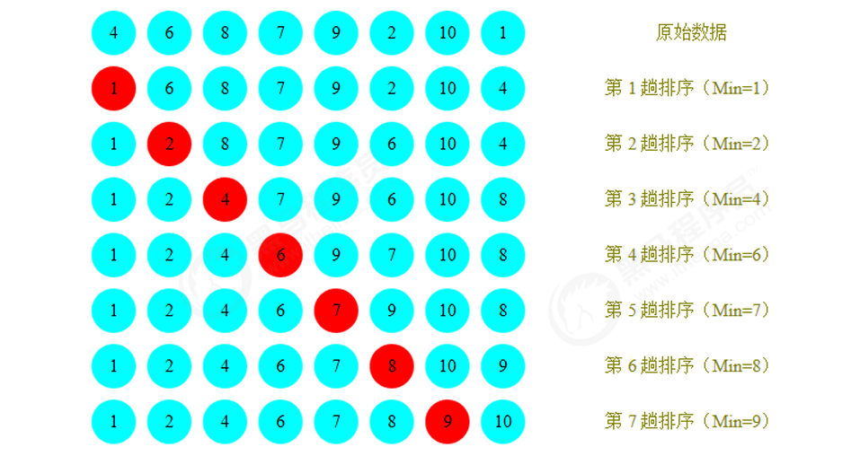

## 排序

### 一、简单排序

在我们的程序中，排序是非常常见的一种需求，提供一些数据元素，把这些数据元素按照一定的规则进行排序。比
如查询一些订单，按照订单的日期进行排序；再比如查询一些商品，按照商品的价格进行排序等等。所以，接下来
我们要学习一些常见的排序算法。
在java的开发工具包jdk中，已经给我们提供了很多数据结构与算法的实现，比如List，Set，Map，Math等等，都
是以API的方式提供，这种方式的好处在于一次编写，多处使用。我们借鉴jdk的方式，也把算法封装到某个类中，
那如果是这样，在我们写java代码之前，就需要先进行API的设计，设计好之后，再对这些API进行实现。
就比如我们先设计一套API如下：
类名
构造方法
成员方法
ArrayList
ArrayList()：创建ArrayList对象
1.boolean add(E e)：向集合中添加元素       
2.E remove(int index):从集合中删除指定的元素
然后再使用java代码去实现它。以后我们讲任何数据结构与算法都是以这种方式讲解

#### 1.1 Comparable

接口介绍
由于我们这里要讲排序，所以肯定会在元素之间进行比较，而Java提供了一个接口Comparable就是用来定义排序
规则的，在这里我们以案例的形式对Comparable接口做一个简单的回顾。
需求：
1.定义一个学生类Student，具有年龄age和姓名username两个属性，并通过Comparable接口提供比较规则；
2.定义测试类Test，在测试类Test中定义测试方法Comparable getMax(Comparable c1,Comparable c2)完成测试

```java
// 学生类
public class Student implements Comparable<Student>{
private String username;
private int age;
public String getUsername() {
return username;
}
public void setUsername(String username) {
this.username = username;
}
public int getAge() {
return age;
}
北京市昌平区建材城西路金燕龙办公楼一层   电话：400-618-9090
1.2 冒泡排序
冒泡排序（Bubble Sort），是一种计算机科学领域的较简单的排序算法。
需求：
排序前：{4,5,6,3,2,1}

    public void setAge(int age) {
        this.age = age;
    }
 
    @Override
    public String toString() {
        return "Student{" +
                "username='" + username + '\'' +
                ", age=" + age +
                '}';
    }
    //定义比较规则
    @Override
    public int compareTo(Student o) {
        return this.getAge()-o.getAge();
    }
}

//测试类
public class Test {
public static void main(String[] args) {

        Student stu1 = new Student();
        stu1.setUsername("zhangsan");
        stu1.setAge(17);
 
        Student stu2 = new Student();
        stu2.setUsername("lisi");
        stu2.setAge(19);
 
        Comparable max = getMax(stu1, stu2);
        System.out.println(max);
    }
    //测试方法，获取两个元素中的较大值
    public static Comparable getMax(Comparable c1,Comparable c2){
        int cmp = c1.compareTo(c2);
        if (cmp>=0){
            return c1;
        }else{
            return c2;
        }
    }
}
```

#### 1.2 冒泡排序

冒泡排序（Bubble Sort），是一种计算机科学领域的较简单的排序算法。
需求：
排序前：{4,5,6,3,2,1}
排序后：{1,2,3,4,5,6}
排序原理：



1. 比较相邻的元素。如果前一个元素比后一个元素大，就交换这两个元素的位置。
2. 对每一对相邻元素做同样的工作，从开始第一对元素到结尾的最后一对元素。最终最后位置的元素就是最大值。
   冒泡排序API设计：
   类名
   Bubble
   构造方法 Bubble()：创建Bubble对象
   成员方法
   1.public static void sort(Comparable[] a)：对数组内的元素进行排序       
   2.private static boolean greater(Comparable v,Comparable w):判断v是否大于w
   3.private static void exch(Comparable[] a,int i,int j)：交换a数组中，索引i和索引j处的值
   冒泡排序的代码实现：
   
   排序代码
   
   ```java
    public class Selection {
       /*
           对数组a中的元素进行排序
        */
       public static void sort(Comparable[] a){
           for (int i=0;i<=a.length-2;i++){
               //假定本次遍历，最小值所在的索引是i
               int minIndex=i;
               for (int j=i+1;j<a.length;j++){
                   if (greater(a[minIndex],a[j])){
                       //跟换最小值所在的索引
                       minIndex=j;
                   }
               }
               //交换i索引处和minIndex索引处的值
               exch(a,i,minIndex);
           }
       }
    
       /*
           比较v元素是否大于w元素
        */
       private static  boolean greater(Comparable v,Comparable w){
           return v.compareTo(w)>0;
       }
    
       /*
       数组元素i和j交换位置
        */
       private static void exch(Comparable[] a,int i,int j){
           Comparable t = a[i];
           a[i]=a[j];
           a[j]=t;
       }
    
   }
    
   //测试代码
   public class Test {
       public static void main(String[] args) {
           Integer[] a = {4,6,8,7,9,2,10,1};
           Selection.sort(a);
           System.out.println(Arrays.toString(a));
       }
    }
   ```
   
   
   冒泡排序的时间复杂度分析 冒泡排序使用了双层for循环，其中内层循环的循环体是真正完成排序的代码，所以，我们分析冒泡排序的时间复杂度，主要分析一下内层循环体的执行次数即可。
   在最坏情况下，也就是假如要排序的元素为{6,5,4,3,2,1}逆序，那么：
   元素比较的次数为：
   (N-1)+(N-2)+(N-3)+...+2+1=((N-1)+1)*(N-1)/2=N^2/2-N/2;
   元素交换的次数为：
   (N-1)+(N-2)+(N-3)+...+2+1=((N-1)+1)*(N-1)/2=N^2/2-N/2;
   总执行次数为：
   (N^2/2-N/2)+(N^2/2-N/2)=N^2-N;
   按照大O推导法则，保留函数中的最高阶项那么最终冒泡排序的时间复杂度为O(N^2).
